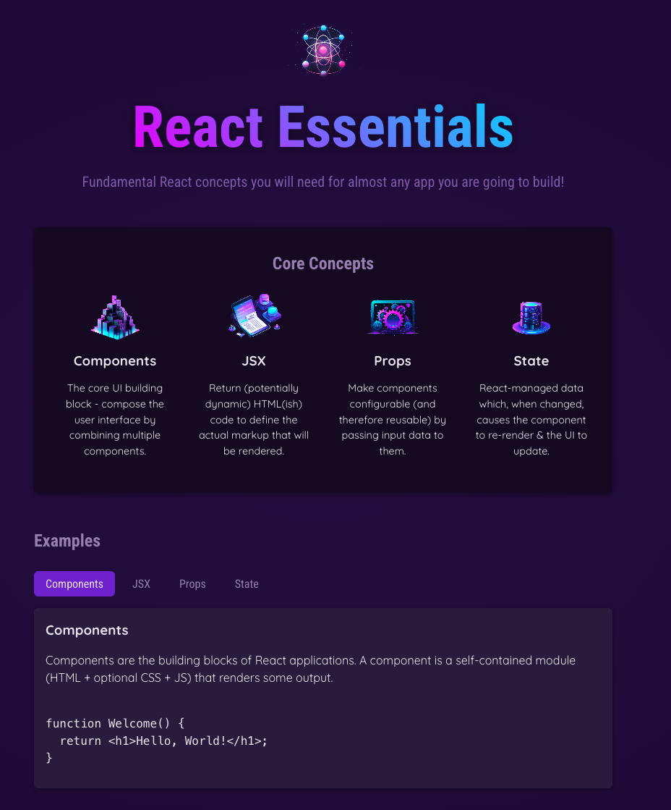

# React Essentials

A React application demonstrating core concepts including components, JSX, props, and state management with an interactive UI.

## Technologies Used

- React 18
- Vite
- CSS3
- JavaScript (ES6+)

## Prerequisites

- Node.js (v14 or higher)
- npm (v6 or higher)

## Installation

1. Clone the repository
2. Install dependencies: `npm install`
3. Start the development server: `npm run dev`

## Features

- Interactive UI with state management
- Utilizes core React concepts
- Responsive design